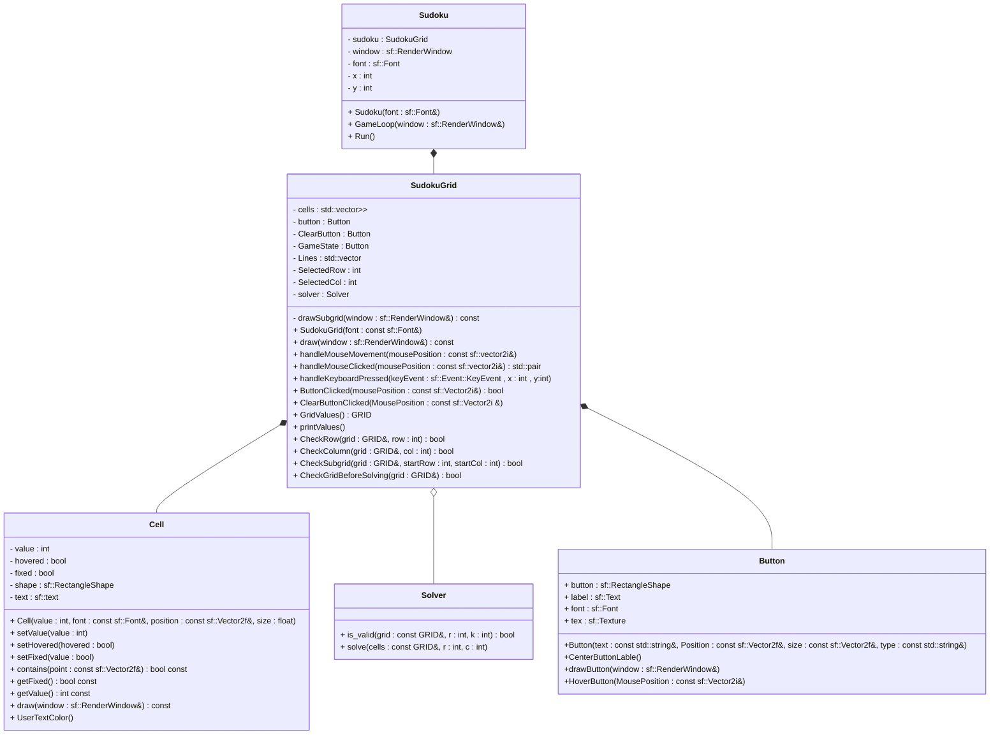

# Suduko Solver
- It is a sudoku solver gui game made using **SFML**, **C++**
- [Backtracking Algorithm](https://en.wikipedia.org/wiki/Backtracking) is used to solve the sudoku grid.

# Preview
https://github.com/zedoh/PRODIGY_SD_04/assets/48362347/8d05a63d-8e5b-40de-9db8-54c82859153b
# Controls
- `Left click` on the cell to give a value.
- `Left click` + `DEL` to delete a value
- `ESC` to close the game
# Datastructures and Algorithms 
| Data Structure / Algorithm | Description | Example Usage |
| -------------------------- | ----------- | ------------- |
| Grid                       | Represents the Sudoku grid as a 2D array of integers. | Storing and manipulating the Sudoku puzzle. |
| Backtracking Algorithm     | Recursive algorithm used to solve the Sudoku puzzle. | Solving the Sudoku puzzle efficiently. |
| Button Class               | Represents interactive buttons in the GUI. | Creating buttons for solving and clearing the Sudoku grid. |
| Cell Class                 | Represents individual cells in the Sudoku grid. | Handling user input and displaying cell values. |

# UML Class Diagram

